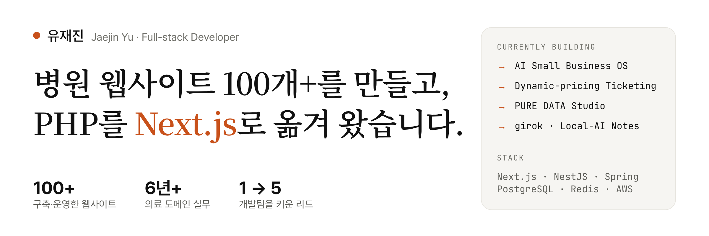

<picture>
  <source media="(prefers-color-scheme: dark)" srcset="./assets/banner-dark.png">
  
</picture>

[포트폴리오](https://jaejinu.co.kr) · [이력서](https://jaejinu.co.kr/resume) · [프로젝트](https://jaejinu.co.kr/projects) · [연락하기](mailto:dbwowls12345@naver.com)

---

### 어떤 개발자인가

- 병의원 웹 에이전시에서 **6년 동안 홈페이지·CRM·관리자 시스템**을 만들고 운영했습니다.
- 1인 개발 조직을 **5인 팀**으로 키우며 PHP 직접 배포를 **Next.js·NestJS + Docker + GitHub Actions** 체계로 옮겼습니다.
- 배포 뒤에 드러나는 보안 구멍과 장애를 **원인부터 찾아 막는 것**까지 제 일로 여깁니다.
- AI(Claude Code·Codex)로 구현 속도를 높이되, **설계·판단·검증은 직접** 합니다.

---

### 대표 프로젝트

> 각 프로젝트는 **문제 → 해결 → 결과** 순서로 정리했습니다.

#### 🎟️ [다이나믹 프라이싱 티켓팅](https://github.com/jaejinu/ticketing)
`Spring Boot 3` `Kafka Streams` `Redis(Redisson)` `TimescaleDB` `Next.js 16` `Gatling`

| | |
|---|---|
| **문제** | 티켓 오픈 순간의 폭주 속에서 좌석 중복 판매 없이, 수요에 따라 가격이 실시간으로 움직이게 하려면? |
| **해결** | 모듈러 모놀리스(Gradle 멀티모듈). Redisson 분산락으로 좌석 점유, Saga + Outbox로 결제 일관성 확보, Kafka Streams 1초 윈도우로 가격 산출, 가상 대기열과 매크로 점수 모델로 봇 차단 |
| **결과** | 로컬 부하 테스트 실측 **좌석 중복 판매 0건 · 좌석맵 p95 13ms · 결제 p95 21ms · 봇 차단률 100% · 정상 사용자 오탐 0건** ([KPI 리포트](https://github.com/jaejinu/ticketing/blob/main/docs/loadtest/2026-07-28-kpi-report.md)) |

#### 🤖 [AI Small Business OS](https://github.com/jaejinu/aismall) · [데모](https://aismall.vercel.app)
`UX 기획` `Figma 디자인 시스템` `Next.js 16` `TypeScript`

| | |
|---|---|
| **문제** | 1~5인 필라테스·요가 스튜디오가 AI에 업무를 맡기려면, AI가 무엇을 하려는지 이해하고 통제할 수 있어야 한다 |
| **해결** | "AI는 제안, 사람은 승인" 원칙. 위험도별 승인 흐름, 끌 수 없는 규칙, 실패를 숨기지 않는 결과 화면(된 것·안 된 것·다음 행동)을 설계 |
| **결과** | PRD·정책 정리와 외부 검토 15건 반영 → Figma 컴포넌트 57개 디자인 시스템 → 관리자·모바일 승인·회원 앱 퍼블리싱까지 1인 진행 |

#### 📊 [PURE DATA Studio](https://github.com/jaejinu/dataanalytics)
`NestJS 11` `BullMQ` `Python·Polars` `PostgreSQL` `S3(MinIO)` `React 19`

| | |
|---|---|
| **문제** | 브랜드·경쟁사 언급을 네이버 뉴스·블로그에서 모아 정기적으로 비교 분석하고 싶다 |
| **해결** | API와 워커를 큐로 분리하고, 수집 스냅샷은 객체 저장소에, 정제 결과는 Parquet로 남기는 파이프라인. 회사 단위 권한·초대·API 호출 예산 관리 |
| **결과** | 정기 수집, 경쟁사 비교, 출처를 근거로 다는 보고서까지 동작. 회사 간 접근 차단·재시도·중복 억제를 통합 테스트로 검증 |

#### 🗓️ [위클리픽](https://github.com/jaejinu/weekly-pick) · [라이브](https://weekly-pick.vercel.app)
`Vanilla JS` `Supabase Auth·RLS` `Playwright` `Vercel`

| | |
|---|---|
| **문제** | 이번 주말 서울에서 갈 만한 전시·팝업을 찾으려면 여러 SNS를 뒤져야 한다 |
| **해결** | 매주 목요일 발행하는 큐레이션 매거진 모바일 웹. AI 시안을 Figma로 다듬고 디자인 기준 문서로 정리해 화면 전체에 같은 기준을 적용 |
| **결과** | 11개 화면, 이메일 로그인과 계정별 저장·후기 동기화. PR마다 Chromium·WebKit 브라우저 테스트 자동 실행 |

#### 🔥 [육십육 (SIXTYSIX)](https://github.com/jaejinu/sixtysix) · [라이브](https://sixtysix-taupe.vercel.app)
`React 19` `TypeScript` `Vite` `Figma`

| | |
|---|---|
| **문제** | 습관 챌린지 단톡방은 처음엔 북적이다가 조용히 다 나간다 |
| **해결** | 같은 날 시작한 30명 코호트가 66일을 함께 인증하는 구조. 기능보다 서비스 정책 10개와 화면 상태 6개를 먼저 정한 뒤 설계 |
| **결과** | V1(HTML·JS 12화면)을 기준으로 V2를 React·TS로 재구축 중. 테스트 169개 통과 |

#### 📝 [기록 (girok)](https://github.com/jaejinu/girok)
`Next.js 16 PWA` `NestJS` `pgvector` `Meilisearch` `Ollama`

| | |
|---|---|
| **문제** | 메모는 대충 적고 싶은데, 나중에 찾으려면 정리가 되어 있어야 한다 |
| **해결** | 맥북 한 대를 개인 서버로. 로컬 AI가 태그·유형을 자동 정리하고, 한국어 키워드 검색 + 의미 검색을 함께 쓰는 하이브리드 검색 |
| **결과** | 외부 API 없이 내 기기 안에서 동작. Tailscale로 폰에서 PWA로 접속 |

<b>그 밖의 작업</b>

 

| 프로젝트 | 내용 | 스택 |
|---|---|---|
| [복음온](https://github.com/jaejinu/gospel-on) | 교회 수련회 안내·신청·설문·관리자 웹앱. 지인 의뢰로 1인 개발, 운영 중 | Next.js 16 · Prisma · PostgreSQL |
| [Quiz Platform](https://github.com/jaejinu/quiz-platform) | 실시간 멀티플레이 퀴즈. 다중 서버 브로드캐스트·실시간 리더보드 | Spring Boot · STOMP · Redis Pub/Sub · RabbitMQ |
| [Habit Tracker API](https://github.com/jaejinu/jaejinu_project004_habit_tracker) | README에 넣는 잔디형 습관 캘린더 SVG 공개 API | Spring Boot · Querydsl · Redis |
| [DevMatch](https://github.com/jaejinu/devmatch) | 기술 스택 기반 사이드 프로젝트 팀원 매칭 | Spring Boot · Elasticsearch · Spring Batch |
| [어디든](https://eodideun-travel.vercel.app) | 커플용 국내 여행 룰렛·여행 기록 (공동 작업, 비공개 레포) | Next.js · OpenAI · Vercel Blob |
| [빙그레할 틈](https://binggrae-moment-3d.vercel.app) | 브랜드 리뉴얼 콘셉트 3D 웹 (팀 프로젝트, 비공개 레포) | Nuxt · Three.js · GSAP |

---

### 실무에서 한 일

> 클라이언트 코드라 레포는 공개하지 않고, 한 일을 글로 정리했습니다. 자세한 내용은 [포트폴리오](https://jaejinu.co.kr/projects)에 있습니다.

**(주) 와커스** · 팀장 → 실장 · 2023.01 – 2026.08

- **척추 전문 병원 PHP → Next.js·NestJS 이전**: 변환 스크립트 방식을 사흘 만에 버리고 1:1 이전으로 전환해 공개 페이지 39개(한·영)와 관리자 운영 전환. 이미지 258MB → 12MB
- **병원 블로그 멀티 클라이언트 CMS**: 병원별 저장소 복제를 설정·환경 변수 분리로 통합. 8인 프로젝트에서 백엔드·관리자단 주도
- **피부과 관리자·운영 시스템**: 메뉴별 보기·쓰기·삭제 권한, 운영 모듈 11개 신규 구축, 인사 민감정보 암호화와 열람 기록
- **블루-그린 배포 템플릿**: 헬스체크 통과 시에만 전환하고 실패 시 롤백. 병원 사이트 세 곳에서 운영 중
- **안과 사이트 SSR·검색 노출 개선**: 4개 언어 전 페이지 초기 HTML에 본문과 내부 링크가 담기도록 수정
- **다국어 병원 사이트 SEO/AEO 개선**: Lighthouse SEO 점수 35 → 88
- **운영 장애·보안 대응**: DB 커넥션 풀 소진의 근본 원인 수정, 인증·권한 누락 보완, 인증서·디스크 문제 재발 방지

**(주) 에드엔 · 닥터허브** · 대리 · 2020.07 – 2023.01

- Spring Boot·JPA·MySQL로 병의원 CRM(예약·고객·통계) 설계·개발, 병의원 홈페이지 20개 제작·유지보수

---

### 기술

| 분야 | 주로 쓰는 것 |
|---|---|
| Frontend | Next.js · React · TypeScript · Nuxt · Tailwind CSS |
| Backend | NestJS · Spring Boot · Node.js · PHP |
| Data | PostgreSQL · MySQL · Redis · Kafka · BullMQ · Prisma · TypeORM · JPA |
| Infra | AWS(Lightsail·S3) · Docker · Nginx · GitHub Actions · Vercel |
| 검색 노출 | SEO · AEO · GEO · 구조화 데이터 · llms.txt |
| Design | Figma · 디자인 시스템 · UX 기획 |

청주대학교 컴퓨터정보공학과 · SQLD
